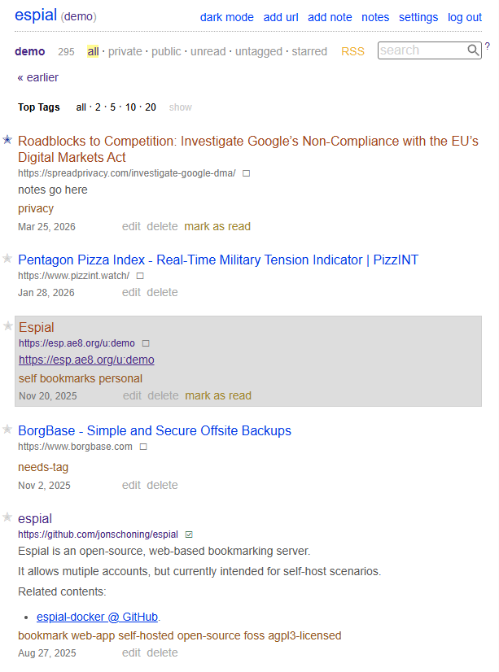

# Espial

Espial is an open-source, web-based bookmarking server.

It allows mutiple accounts, but currently intended for self-host scenarios.

The bookmarks are stored in a sqlite3 database, for ease of deployment & maintenence.

The easist way for logged-in users to add bookmarks, is with the "bookmarklet", found on the Settings page.

## Demo Server

Log in with:

- username: `demo`
- password: `demo`

https://espdemo.ae8.org/u:demo



## Installation

### Docker Setup

See:

https://github.com/jonschoning/espial-docker

### Server Setup (From Source)

1. Install the Stack executable here:
   - https://tech.fpcomplete.com/haskell/get-started
2. Build executables:

```bash
stack build
```

3. Create the database:

```bash
stack exec migration -- createdb
```

4. Create a user:

```bash
stack exec migration -- createuser --userName myusername --userPassword myuserpassword
```

5. Import a pinboard bookmark file for a user (optional):

```bash
stack exec migration -- importbookmarks --userName myusername --bookmarkFile sample-bookmarks.json
```

6. Import a firefox bookmark file for a user (optional):

```bash
stack exec migration -- importfirefoxbookmarks --userName myusername --bookmarkFile firefox-bookmarks.json
```

7. Start a production server:

```bash
stack exec espial
```

## Configuration

See `config/settings.yml` for changing default run-time parameters & environment variables.

- `config/settings.yml` is embedded into the app executable when compiled and also read once when the app starts. Current settings in `config/settings.yml` will override the embedded compile-time settings.
- `config/settings.yml` values formatted like `_env:ENV_VAR_NAME:default_value` can be overridden by the specified environment variable.
- Example:
  - `_env:PORT:3000`
  - environment variable `PORT`
  - default app http port: `3000`

### Request IP Logging

Espial supports the `IP_FROM_HEADER` environment variable for request logging.

- `IP_FROM_HEADER=true`: log the client IP from the `X-Real-IP` or `X-Forwarded-For` header when present, and fall back to the peer address if neither header is available.
- `IP_FROM_HEADER=false`: log the peer address from the HTTP connection.

Only set `IP_FROM_HEADER=true` if your application is safely positioned **behind a trusted reverse proxy**.

### SSL / Reverse Proxy

Espial does not terminate TLS itself. Run it behind a reverse proxy that handles HTTPS and forwards traffic to Espial over HTTP.

For container-based deployment examples, including production-oriented layouts, see the `espial-docker` repository:

- https://github.com/jonschoning/espial-docker

Minimal [Caddy](https://github.com/caddyserver/caddy) example:

Localhost without a real domain:

```caddyfile
https://localhost:3050 {
    reverse_proxy localhost:3000
}
```

or with a domain:

```caddyfile
espial.example.com {
  reverse_proxy 127.0.0.1:3000
}
```

With the domain setup:

- Caddy terminates TLS for `espial.example.com`.
- Espial continues listening on HTTP, locally on `127.0.0.1:3000`
  - If using Docker Compose, it would like like `espial:3000`
- Set `IP_FROM_HEADER=true` only when Espial is reachable solely through that trusted proxy.

If you are using Cloudflare:

- Prefer Cloudflare SSL mode `Full (strict)`.
- use `header_up X-Forwarded-For {http.request.header.CF-Connecting-IP}`
- If traffic can reach Espial directly without passing through your trusted proxy, do not enable `IP_FROM_HEADER=true`, because client IP headers can be spoofed.

## Archive Backends

Espial supports configurable archive backends for saving bookmark snapshots.

Set the backend with `archive-backend` in `config/settings.yml`:

- `disabled`: archiving is turned off (default).
- `wayback-machine`: enables submission to the Internet Archive Wayback Machine.

  Wayback Machine support requires the following settings:
  - `wayback-machine-access-key`
  - `wayback-machine-secret-key`

    Create these by signing in to your Internet Archive account and generating S3-style API credentials at `https://archive.org/account/s3.php`. \
     If `wayback-machine` is selected but the access key or secret key is missing, archiving is disabled at runtime.

- `archivebox07`: queues the URL in a local ArchiveBox 0.7 instance and stores an ArchiveBox link on the bookmark.

  **IMPORTANT - ArchiveBox stores all archive data in a single global index space, so this arcive-backend is best suited to single-user Espial instances.**

  **Recommended setup is to use Docker Compose to run the ArchiveBox instance**
  - Simple example, running on localhost: [docker-compose.archivebox07.yml](docker-compose.archivebox07.yml)
  - See https://github.com/jonschoning/espial-docker for more examples intended for deployment
  - In all examples, you must change the `ARCHIVEBOX_PASSWORD` from it's default value.

  ArchiveBox support requires the following settings:
  - `archivebox-url`

    `archivebox-url` is the URL espial uses to sign in to ArchiveBox and submit URLs through the web UI. In Docker Compose this is typically `http://archivebox:8000`.

  - `archivebox-public-url` (optional)

    Public ArchiveBox URL stored on bookmarks.

  - `archivebox-username` plus `archivebox-password`

    Espial signs in to the ArchiveBox web UI with these credentials before submitting URLs.

  - `archivebox-tag` (optional)

    A tag Espial adds to submissions (example: `espial`).

  - `archivebox-plugins` (optional)

    Comma-separated list of ArchiveBox methods (plugins) to request when submitting URLs, e.g. `title,favicon,singlefile,screenshot`.

  Set the ArchiveBox admin credentials in the override path by supplying:
  - `ARCHIVEBOX_USERNAME=...`
  - `ARCHIVEBOX_PASSWORD=...`

  The `Makefile` includes the following helpers:
  - `docker-compose-up-archivebox07`
  - `docker-compose-up-d-archivebox07`
  - `docker-compose-exec-archivebox07`

  Or start the instance manually via docker compose, example:

  ```bash
  docker compose -f docker-compose.archivebox07.yml up
  ```

  Configure the enrivonment variable `ARCHIVE_METHODS` to control which archive methods ArchiveBox uses:

  ```yaml
  environment:
    - ARCHIVE_METHODS=title,favicon,singlefile,screenshot
  ```

  Available ARCHIVE_METHODS plugins:
  - `archive_org`, `dom`, `favicon`, `git`, `headers`, `htmltotext`, `media`, `mercury`, `pdf`, `readability`, `screenshot`, `singlefile`, `title`, `wget`

  If `ARCHIVE_METHODS` is unset/not-present, ArchiveBox will uses all plugins.

  For additional information and configuration, refer to the [ArchiveBox repository](https://github.com/ArchiveBox/ArchiveBox)

Optional proxy settings for archive requests:

- `archive-socks-proxy-host`
- `archive-socks-proxy-port`

## Related Projects

Also, see the android app for adding bookmarks via an Android Share intent:

https://github.com/jonschoning/espial-share-android

## Development

### Frontend

- See `frontend/` folder

## CLI

Migration commands are run via:

```bash
stack exec migration -- <command> [options]
```

All commands take an optional `--conn` parameter for the database location; if omitted, the database location is loaded from `config/settings.yml` or environment variable `SQLITE_DATABASE`

### Commands

| Command                      | Example                                                                                                        |
| ---------------------------- | -------------------------------------------------------------------------------------------------------------- |
| `createdb`                   | `stack exec migration -- createdb`                                                                             |
| `createuser`                 | `stack exec migration -- createuser --userName myusername --userPassword myuserpassword`                       |
| `createuser` (password file) | `stack exec migration -- createuser --userName myusername --userPasswordFile mypassword.txt`                   |
| `deleteuser`                 | `stack exec migration -- deleteuser --userName myusername`                                                     |
| `createapikey`               | `stack exec migration -- createapikey --userName myusername`                                                   |
| `deleteapikey`               | `stack exec migration -- deleteapikey --userName myusername`                                                   |
| `importbookmarks`            | `stack exec migration -- importbookmarks --userName myusername --bookmarkFile sample-bookmarks.json`           |
| `importfirefoxbookmarks`     | `stack exec migration -- importfirefoxbookmarks --userName myusername --bookmarkFile firefox-bookmarks.json`   |
| `importnetscapebookmarks`    | `stack exec migration -- importnetscapebookmarks --userName myusername --bookmarkFile bookmarks.html`          |
| `importnotes`                | `stack exec migration -- importnotes --userName myusername --noteDirectory ./notes`                            |
| `exportbookmarks`            | `stack exec migration -- exportbookmarks --userName myusername --bookmarkFile exported-bookmarks.json`         |
| `exportnetscapebookmarks`    | `stack exec migration -- exportnetscapebookmarks --userName myusername --bookmarkFile exported-bookmarks.html` |
| `printmigratedb`             | `stack exec migration -- printmigratedb`                                                                       |
| `showuser`                   | `stack exec migration -- showuser --userName myusername`                                                       |

### `importbookmarks` Command Notes:

See `sample-bookmarks.json`, which contains a JSON array, each line containing a `FileBookmark` object.

Example:

```json
[
  {
    "href": "http://raganwald.com/2018/02/23/forde.html",
    "description": "Forde's Tenth Rule, or, \"How I Learned to Stop Worrying and \u2764\ufe0f the State Machine\"",
    "extended": "",
    "time": "2018-02-26T22:57:20Z",
    "shared": "yes",
    "toread": "yes",
    "tags": "raganwald"
  },
  ,
  {
    "href": "http://downloads.haskell.org/~ghc/latest/docs/html/users_guide/flags.html",
    "description": "7.6. Flag reference \u2014 Glasgow Haskell Compiler 8.2.2 User's Guide",
    "extended": "-fprint-expanded-synonyms",
    "time": "2018-02-26T21:52:02Z",
    "shared": "yes",
    "toread": "no",
    "tags": "ghc haskell"
  }
]
```
