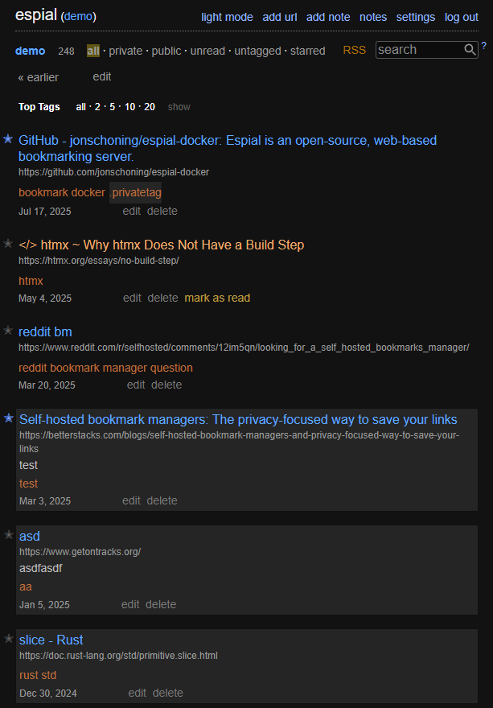

# Espial

Espial is an open-source, web-based bookmarking server.

It supports multiple user accounts and is primarily intended for self-hosted deployments.

Bookmarks are stored in a SQLite database to keep setup and maintenance straightforward.

Espial also includes [internationalization](#internationalization) support.

### Adding Bookmarks

The easist way for logged-in users to add bookmarks, is with the "bookmarklet", found on the Settings page.

Espial also supports file import options (see [CLI](#cli), or the settings -> Import / Export page in the web UI).

#### Using the Bookmarklet

1. Log in and go to the Settings page.
2. Drag the "add url bookmarklet" link into your browser's bookmarks bar (or otherwise save the link as a bookmark in the browser)
3. While viewing any page you want to save, click the bookmarklet in your bookmarks bar.
4. A small popup opens with the URL, title, and any selected text (as the description) pre-filled — add tags or edit the fields, then save.
5. Visit or re-fresh the Espial page to see the added bookmark

## Demo Server

Log in with:

- username: `demo`
- password: `demo`

https://espdemo.ae8.org/u:demo



## Related Projects

Also, see the android app for adding bookmarks via an Android Share intent:

https://github.com/jonschoning/espial-share-android

## Installation

### Docker Setup (Recommended Method)

Docker installation is the recommended approach for most deployments.

See:

https://github.com/jonschoning/espial-docker

### Docker Quick Start: Single `docker run` Command (Named Volume)

For a quick trial, or a minimal setup without cloning [espial-docker](https://github.com/jonschoning/espial-docker), run Espial directly with a single `docker run` command backed by a Docker-managed named volume for storage of the sqlite database:

1. Create the container:

```bash
MSYS_NO_PATHCONV=1 docker run --name espial \
  -p 9090:3000 \
  -v espial-data:/app/data \
  -d jonschoning/espial:espial
```

- Maps host port `9090` to Espial's internal port `3000` — change `9090` to whatever port you prefer.
- Creates a named volume called `espial-data` at `/app/data`; the sqlite database will be stored inside a docker Named Volume.

2. Create a user:

```bash
docker exec espial ./migration createuser --userName myusername --userPassword myuserpassword
```

3. Log in and create bookmarks from the bookmarklet (see [Using the Bookmarklet](#using-the-bookmarklet)), or import bookmarks from the settings -> Import / Export page (try importing [sample-bookmarks.json](./sample-bookmarks.json) )

### Setup From Source

1. Install Haskell tooling (choose one):
   - **Stack**: https://docs.haskellstack.org/en/stable/
   - **GHCup** (installs GHC, Stack, and more): https://www.haskell.org/ghcup/install/
2. Build executables:

```bash
stack build
```

3. Create the database:

```bash
stack exec migration -- createdb
```

4. Create a user:

```bash
stack exec migration -- createuser --userName myusername --userPassword myuserpassword
```

5. Import a pinboard bookmark file for a user (optional):

```bash
stack exec migration -- importbookmarks --userName myusername --bookmarkFile sample-bookmarks.json
```

6. Import a firefox bookmark file for a user (optional):

```bash
stack exec migration -- importfirefoxbookmarks --userName myusername --bookmarkFile firefox-bookmarks.json
```

7. Start a production server:

```bash
stack exec espial
```

## API

### Adding a Bookmark via `curl`

Bookmarks can be added programmatically by POSTing JSON to `/api/add`, authenticated with an API key.

1. Generate an API key for a user, either:
   - From the Account Settings (`settings`) page in the web UI, under **API Key** — click **Create API Key** (or **Reset API Key** to replace an existing one). The key is shown only once, so copy it immediately.
   - Or via the CLI:

     ```bash
     stack exec migration -- createapikey --userName myusername
     ```

2. Call the endpoint, passing the key in the `Authorization: ApiKey <key>` header:

Example Request:

```bash
curl -X POST https://your-espial-host/api/add \
  -H "Authorization: ApiKey <key>" \
  -H "Content-Type: application/json" \
  -H "Accept: application/json" \
  -d '{
        "url": "https://example.com",
        "title": "Example Site",
        "description": "",
        "tags": "example some-tag",
        "private": false,
        "toread": false
      }'
```

Only `url` is required; all other fields are optional. On success the response is `201 Created` with the new bookmark id, or `204 No Content` if an existing bookmark was updated instead — matched by `bid` if given, otherwise by the (`userid`, `url`) pair.

### `/api/add` Fields

| Field              | Type      | Description                                                                                                                                                                                  |
| ------------------ | --------- | -------------------------------------------------------------------------------------------------------------------------------------------------------------------------------------------- |
| `url`              | `string`  | The bookmark's URL. Required.                                                                                                                                                                |
| `title`            | `string`  | The bookmark's title/description line. Defaults to empty.                                                                                                                                    |
| `description`      | `string`  | Extended/longer notes for the bookmark. Defaults to empty.                                                                                                                                   |
| `tags`             | `string`  | Space-separated list of tags, e.g. `"example some-tag"`.                                                                                                                                     |
| `private`          | `boolean` | `true` keeps the bookmark private to the owner; `false` (or omitted) makes it shared/public.                                                                                                 |
| `toread`           | `boolean` | Marks the bookmark on the "to read" list. Defaults to `false`.                                                                                                                               |
| `bid`              | `number`  | Existing bookmark id to update. Omit to create a new bookmark (or update by matching `url` — see above).                                                                                     |
| `slug`             | `string`  | URL-friendly identifier used in bookmark links (`u:<user>/<slug>`). Auto-generated when omitted.                                                                                             |
| `selected`         | `boolean` | Whether the bookmark is "starred". Defaults to `false`.                                                                                                                                      |
| `time`             | `string`  | Creation timestamp, ISO 8601 (e.g. `"2018-02-26T22:57:20Z"`). Defaults to the current time; useful when importing bookmarks with a historical date.                                          |
| `archiveUrl`       | `string`  | Link to an already-archived copy of the page. Normally set by the archiver, not supplied by clients.                                                                                         |
| `archiveRequested` | `boolean` | Whether to kick off archiving of `url` after saving. Only takes effect when an archive backend is configured (see [Archive Backends](#archive-backends)). Not stored on the bookmark itself. |

### Adding Multiple Bookmarks via `curl`

Multiple bookmarks can be added in a single request by POSTing a JSON array to `/api/addBulk`, using the same fields and auth as `/api/add`.

Example Request:

```bash
curl -X POST https://your-espial-host/api/addBulk \
  -H "Authorization: ApiKey <key>" \
  -H "Content-Type: application/json" \
  -H "Accept: application/json" \
  -d '
  [
    {
      "url": "https://example.com/11111111",
      "title": "Example Site 1",
      "description": "Random test bookmark 11111111",
      "tags": "example test run1",
      "private": false,
      "toread": false
    },
    {
      "url": "https://example.com/22222222",
      "title": "Example Site 2",
      "description": "Random test bookmark 22222222",
      "tags": "example test run2",
      "private": false,
      "toread": false
    },
    {
      "url": "33333333",
      "title": "Example Site 3",
      "description": "Random test bookmark 33333333",
      "tags": "example test run3",
      "private": false,
      "toread": false
    }
  ]'
```

The response is `200 OK` with a JSON array of per-bookmark results, in the same order as the request:

```json
[
  { "status": "created", "id": 105831 },
  { "status": "updated", "id": 105832 },
  {
    "status": "failed",
    "error": "Invalid URL: InvalidUrlException \"33333333\" \"Invalid URL\""
  }
]
```

If the request array has more items than the `add-bulk-max-items` setting allows (default `200`), the response is `413 Payload Too Large` and no bookmarks are saved.

## Configuration

See `config/settings.yml` for changing default run-time parameters & environment variables.

- `config/settings.yml` is embedded into the app executable when compiled and also read once when the app starts. Current settings in `config/settings.yml` will override the embedded compile-time settings.
- `config/settings.yml` values formatted like `_env:ENV_VAR_NAME:default_value` can be overridden by the specified environment variable.
- Example:
  - `_env:PORT:3000`
  - environment variable `PORT`
  - default app http port: `3000`

## Internationalization

Espial's frontend supports a selectable UI language per account, on the Account Settings (`settings`) page.

The Server Language default is controlled by `language-default` in `config/settings.yml`, which can also be set with environment variable `LANGUAGE_DEFAULT` to the language code; the default value is `en`.

#### Supported Languages:

| Code      | English name          | Native name        |
| --------- | --------------------- | ------------------ |
| `en`      | English               | English            |
| `de`      | German                | Deutsch            |
| `es`      | Spanish               | Español            |
| `fr`      | French                | Français           |
| `it`      | Italian               | Italiano           |
| `ja`      | Japanese              | 日本語             |
| `ko`      | Korean                | 한국어             |
| `pl`      | Polish                | Polski             |
| `pt-BR`   | Portuguese (Brazil)   | Português (Brasil) |
| `ru`      | Russian               | Русский            |
| `tr`      | Turkish               | Türkçe             |
| `uk`      | Ukrainian             | Українська         |
| `zh-Hans` | Chinese (Simplified)  | 简体中文           |
| `zh-Hant` | Chinese (Traditional) | 繁體中文           |

## Request IP Logging

Espial supports the `IP_FROM_HEADER` environment variable for request logging.

- `IP_FROM_HEADER=true`: log the client IP from the `X-Real-IP` or `X-Forwarded-For` header when present, and fall back to the peer address if neither header is available.
- `IP_FROM_HEADER=false`: log the peer address from the HTTP connection.

Only set `IP_FROM_HEADER=true` if your application is safely positioned **behind a trusted reverse proxy**.

## TLS / Reverse Proxy

A reverse proxy is the recommended approach for production and most self-hosted deployments. For simple local or LAN setups where that is impractical, Espial can also terminate TLS directly — see [Optional: In-Process TLS](#optional-in-process-tls) below.

Set `SSL_ONLY=true` whenever Espial is served over HTTPS (via reverse proxy or in-process TLS) to enable the `Secure` cookie flag and HTTP→HTTPS redirects.

### Recommended: Reverse Proxy (Caddy, nginx, Cloudflare Tunnel, …)

Running Espial behind a reverse proxy is the recommended approach for production and most self-hosted deployments. The proxy terminates TLS and forwards plain HTTP to Espial. This gives you automatic certificate management, HTTP/2 and HTTP/3 at the edge, and cleaner separation of concerns.

For container-based deployment examples, including production-oriented layouts, see the `espial-docker` repository:

- https://github.com/jonschoning/espial-docker

Minimal [Caddy](https://github.com/caddyserver/caddy) example:

Localhost without a real domain:

```caddyfile
https://localhost:3050 {
    reverse_proxy localhost:3000
}
```

or with a domain:

```caddyfile
espial.example.com {
  reverse_proxy 127.0.0.1:3000
}
```

With the domain setup:

- Caddy terminates TLS for `espial.example.com`.
- Espial continues listening on HTTP, locally on `127.0.0.1:3000`
  - If using Docker Compose, it would look like `espial:3000`
- Set `IP_FROM_HEADER=true` only when Espial is reachable solely through that trusted proxy.

If you are using Cloudflare:

- Prefer Cloudflare SSL mode `Full (strict)`.
- use `header_up X-Forwarded-For {http.request.header.CF-Connecting-IP}`
- If traffic can reach Espial directly without passing through your trusted proxy, do not enable `IP_FROM_HEADER=true`, because client IP headers can be spoofed.

#### Running on a Subpath

Espial can also be served under a path prefix on a shared domain, e.g. `https://www.domain.com/espial` alongside other apps on the same host. This needs two pieces working together:

1. **`APPROOT`** — tell Espial the full external URL (including the subpath) it's being served at, so generated links, redirects, and static asset URLs come out correct:

   ```yaml
   approot: "_env:APPROOT:https://www.domain.com/espial"
   ```

   or via environment variable:

   ```bash
   APPROOT=https://www.domain.com/espial stack exec espial
   ```

2. **Reverse proxy** — strip the `/espial` prefix before forwarding to Espial, since Espial itself always routes as if mounted at `/`. Also redirect the bare `/espial` (no trailing slash) to `/espial/` so relative URLs in the page resolve against the right base.

   Minimal Caddy example (see `caddy/Caddyfile-Standalone-Subpath`, which runs Caddy in Docker alongside an Espial instance on the host):

   ```caddyfile
   :80 {
       redir /espial /espial/

       handle_path /espial/* {
           # Caddy pools and reuses idle connections to the backend
           # by default, but Espial's Warp server closes idle connections after 30s
           # set keepalive to off or 15s
           reverse_proxy host.docker.internal:3000 {
               transport http {
                   keepalive off
               }
           }
       }
   }
   ```

   `handle_path` strips the `/espial` prefix before proxying, matching what `APPROOT` told Espial to expect. If Caddy and Espial run on the same host (not in Docker), replace `host.docker.internal:3000` with `localhost:3000`.

### Optional: In-Process TLS

For simple local or LAN deployments where adding a reverse proxy is impractical, Espial can terminate TLS directly using your own certificate and key files (PEM format, unencrypted key).

Set the `TLS_CERT_FILE` and `TLS_KEY_FILE` environment variables (or the corresponding `tls-cert-file` / `tls-key-file` keys in `config/settings.yml`) to the paths of your certificate and private key:

```bash
TLS_CERT_FILE=/path/to/cert.pem TLS_KEY_FILE=/path/to/key.pem stack exec espial
```

Or in `config/settings.yml`:

```yaml
tls-cert-file: "/path/to/cert.pem"
tls-key-file: "/path/to/key.pem"
```

When both values are set Espial listens on HTTPS with HTTP/2 enabled. When either is absent Espial falls back to plain HTTP.

**Certificate rotation** — Espial reloads the certificate from disk automatically every 12 hours without restarting or dropping existing connections. To trigger an immediate reload send `SIGHUP` to the process:

```bash
kill -HUP <espial-pid>
```

**Notes:**

- Let's Encrypt certificates (`fullchain.pem` + `privkey.pem`) work directly.
- A self-signed certificate for local testing can be generated with:
  ```bash
  openssl req -x509 -newkey rsa:2048 -nodes \
    -keyout key.pem -out cert.pem -days 3650 \
    -subj "/CN=localhost" \
    -addext "subjectAltName=DNS:localhost,IP:127.0.0.1"
  ```
- A reverse proxy is still preferred for production: it provides HTTP/3, edge caching, and hides the Espial process from the public internet.

## Archive Backends

Espial can save a snapshot of each bookmarked page. Choose a backend with `archive-backend` in `config/settings.yml` (or the `ARCHIVE_BACKEND` env var):

- `disabled` — archiving off (default).
- `wayback-machine` — submits the page to the Internet Archive's Wayback Machine.
- `monolith` — saves the page as a single self-contained HTML file using the local `monolith` tool. No external service.
- `singlefile` — like `monolith`, but renders the page in headless Chromium first, so JavaScript-built pages archive correctly.
- `chromium` — same JS-rendering benefit as `singlefile`, but Espial drives a remote Chromium over CDP directly and inlines the result with `monolith`. Works with the default Docker image; only the browser needs its own container.
- `archivebox07` — submits the URL to a local ArchiveBox 0.7 instance and links to it from the bookmark.

Except for `wayback-machine` and `archivebox07`, archives are written to `{backend-dir}/{userId}/{bookmarkId}/latest.html` and served at `/archive/bm/{bookmarkId}`, to the bookmark's owner only, sandboxed so archived HTML can't run scripts or reach your Espial session.

### wayback-machine

- `wayback-machine-access-key` (required)
- `wayback-machine-secret-key` (required)

Generate these as S3-style API credentials at `https://archive.org/account/s3.php` after signing in to your Internet Archive account. If either is missing, archiving is disabled at runtime.

Archives are stored by the Internet Archive itself; Espial keeps nothing locally, only the returned Wayback Machine URL on the bookmark.

### monolith

The simplest option — a single local binary, no browser required. Fetches raw HTML/CSS/JS rather than executing it, so pages that render their content via JavaScript archive blank or incomplete.

Install [monolith](https://github.com/Y2Z/monolith) yourself (`cargo install monolith`, `brew install monolith`, distro package, or a [release binary](https://github.com/Y2Z/monolith/releases)) — the Docker image already includes it.

- `monolith-path` (default `monolith`) — path to the executable.
- `monolith-dir` (default `archives`) — where archives are written.
- `monolith-timeout-sec` (default `120`) — kills a hung invocation.
- `monolith-args` (default `-I -q -e -v -a`) — see `monolith --help`; add `-i` to also drop images if archives are too large.

Archives are written locally to `{monolith-dir}/{userId}/{bookmarkId}/latest.html` and served at `/archive/bm/{bookmarkId}`.

### singlefile

Renders the page in a real (headless) Chromium first, so JavaScript-built pages archive correctly, unlike `monolith`. Can run without Docker — any machine with Node and a local Chromium works, since single-file-cli launches its own browser process per archive job.

[single-file-cli](https://github.com/gildas-lormeau/single-file-cli) is a command-line tool that drives Chromium to load a page, then saves it as a single HTML file with all CSS, images, and fonts inlined — the same engine behind the popular "SingleFile" browser extension.

Install it (`npm install -g single-file-cli`), plus either a local Chromium or a remote one reachable over CDP. Under Docker, use [docker-compose.singlefile.yml](docker-compose.singlefile.yml), which pairs a `single-file-cli`-only Espial image with a separate headless-Chromium `browser` container over CDP.

- `singlefile-path` (default `single-file`) — path to the executable. On Windows point this at the npm shim, e.g. `%APPDATA%\npm\single-file.cmd`.
- `singlefile-dir` (default `archives`)
- `singlefile-timeout-sec` (default `120`)
- `singlefile-browser-path` (default `chromium-browser`) — local Chromium executable to drive. Ignored if `singlefile-browser-server` is set.
- `singlefile-browser-args` (default: headless container-friendly flags) — JSON array of Chromium flags. Also ignored if `singlefile-browser-server` is set.
- `singlefile-browser-server` (default empty) — CDP endpoint of an already-running remote Chromium, e.g. `http://172.28.0.10:9222`. Must be a literal IP, not a hostname (Chrome rejects non-IP `Host` headers). CDP has no auth, so only expose this on a trusted network — never publish the port.
- `singlefile-args` (default empty) — extra flags, e.g. `--block-videos=true`.

Archives are written locally to `{singlefile-dir}/{userId}/{bookmarkId}/latest.html` and served at `/archive/bm/{bookmarkId}`.

### chromium

Same JS-rendering benefit as `singlefile`, but with no Node/single-file-cli dependency — Espial talks CDP directly and only needs `monolith` locally to inline the result, so it works with the default Docker image unmodified. The tradeoff: it always needs a separate, already-running Chromium (typically a Docker sidecar), since there's no "launch a local browser" mode like `singlefile` has.

Requires `monolith` (see above) to be installed, since Espial fetches the rendered DOM over CDP itself but still shells out to `monolith` to inline it into one self-contained file.

Use [docker-compose.chromium.yml](docker-compose.chromium.yml), which adds a headless-Chromium `browser` sidecar. CDP has no auth, so its port must never be published — only `espial` should reach it. Unlike `singlefile`'s browser, this one runs long-lived; change its launch flags by editing the sidecar's `command:` in the compose file.

- `chromium-cdp-url` (required, e.g. `http://browser:9222`) — CDP endpoint. Espial resolves hostnames to an IP itself, so a hostname is fine here (unlike `singlefile-browser-server`).
- `chromium-dir` (default `archives`)
- `chromium-timeout-sec` (default `60`) — total budget for loading the page, capturing the DOM, and inlining with `monolith`.
- `chromium-wait-ms` (default `3000`) — extra delay after page load before snapshotting, to let JS-driven rendering settle.

Inlining reuses the `monolith-path`/`monolith-args` settings from the `monolith` backend above.

Archives are written locally to `{chromium-dir}/{userId}/{bookmarkId}/latest.html` and served at `/archive/bm/{bookmarkId}`.

### archivebox07

**Best suited to single-user instances** — ArchiveBox keeps all archive data in one global index shared by everyone.

Recommended: run ArchiveBox via Docker Compose, e.g. [docker-compose.archivebox07.yml](docker-compose.archivebox07.yml) (change `ARCHIVEBOX_PASSWORD` from its default), or see [espial-docker](https://github.com/jonschoning/espial-docker) for deployment examples. Makefile helpers: `docker-compose-up-archivebox07`, `docker-compose-up-d-archivebox07`, `docker-compose-exec-archivebox07`.

- `archivebox-url` (required) — URL Espial uses to sign in and submit URLs, e.g. `http://archivebox:8000` in Compose.
- `archivebox-public-url` (optional) — public URL stored on bookmarks instead.
- `archivebox-username` + `archivebox-password` (required) — sign-in credentials.
- `archivebox-tag` (optional) — tag added to submissions, e.g. `espial`.
- `archivebox-plugins` (optional) — comma-separated ArchiveBox methods to request, e.g. `title,favicon,singlefile,screenshot`.

Set the ArchiveBox container's own admin credentials via `ARCHIVEBOX_USERNAME` / `ARCHIVEBOX_PASSWORD`, and restrict which methods it runs via `ARCHIVE_METHODS` (comma-separated; unset means all):

```yaml
environment:
  - ARCHIVE_METHODS=title,favicon,singlefile,screenshot
```

Available plugins: `archive_org`, `dom`, `favicon`, `git`, `headers`, `htmltotext`, `media`, `mercury`, `pdf`, `readability`, `screenshot`, `singlefile`, `title`, `wget`. See the [ArchiveBox repository](https://github.com/ArchiveBox/ArchiveBox) for details.

Archives are stored inside the ArchiveBox instance's own data directory, not by Espial; the bookmark just links out to `archivebox-url` (or `archivebox-public-url`).

### Proxy (optional, all backends)

- `archive-socks-proxy-host`
- `archive-socks-proxy-port`

## CLI

Migration commands are run via:

```bash
stack exec migration -- <command> [options]
```

All commands take an optional `--conn` parameter for the database location; if omitted, the database location is loaded from `config/settings.yml` or environment variable `SQLITE_DATABASE`

### Commands

| Command                      | Example                                                                                                        |
| ---------------------------- | -------------------------------------------------------------------------------------------------------------- |
| `createdb`                   | `stack exec migration -- createdb`                                                                             |
| `createuser`                 | `stack exec migration -- createuser --userName myusername --userPassword myuserpassword`                       |
| `createuser` (password file) | `stack exec migration -- createuser --userName myusername --userPasswordFile mypassword.txt`                   |
| `deleteuser`                 | `stack exec migration -- deleteuser --userName myusername`                                                     |
| `createapikey`               | `stack exec migration -- createapikey --userName myusername`                                                   |
| `deleteapikey`               | `stack exec migration -- deleteapikey --userName myusername`                                                   |
| `importbookmarks`            | `stack exec migration -- importbookmarks --userName myusername --bookmarkFile sample-bookmarks.json`           |
| `importfirefoxbookmarks`     | `stack exec migration -- importfirefoxbookmarks --userName myusername --bookmarkFile firefox-bookmarks.json`   |
| `importnetscapebookmarks`    | `stack exec migration -- importnetscapebookmarks --userName myusername --bookmarkFile bookmarks.html`          |
| `importnotes`                | `stack exec migration -- importnotes --userName myusername --noteDirectory ./notes`                            |
| `importnotesjson`            | `stack exec migration -- importnotesjson --userName myusername --noteFile exported-notes.json`                 |
| `exportbookmarks`            | `stack exec migration -- exportbookmarks --userName myusername --bookmarkFile exported-bookmarks.json`         |
| `exportnetscapebookmarks`    | `stack exec migration -- exportnetscapebookmarks --userName myusername --bookmarkFile exported-bookmarks.html` |
| `exportnotesjson`            | `stack exec migration -- exportnotesjson --userName myusername --noteFile exported-notes.json`                 |
| `printmigratedb`             | `stack exec migration -- printmigratedb`                                                                       |
| `runmigratedb`               | `stack exec migration -- runmigratedb`                                                                         |
| `showuser`                   | `stack exec migration -- showuser --userName myusername`                                                       |
| `generatesessionkey`         | `stack exec migration -- generatesessionkey`                                                                   |

### `generatesessionkey` Command Notes:

Prints a base64-encoded client session key suitable for the `CLIENT_SESSION_KEY` environment variable. When set, it is used instead of `config/client_session_key.aes`, so sessions survive container recreation (avoiding forced re-login across updated docker images).

### `importbookmarks` Command Notes:

See `sample-bookmarks.json`, which contains a JSON array, each line containing a `FileBookmark` object.

Example:

```json
[
  {
    "href": "http://raganwald.com/2018/02/23/forde.html",
    "description": "Forde's Tenth Rule, or, \"How I Learned to Stop Worrying and \u2764\ufe0f the State Machine\"",
    "extended": "",
    "time": "2018-02-26T22:57:20Z",
    "shared": "yes",
    "toread": "yes",
    "tags": "raganwald"
  },
  ,
  {
    "href": "http://downloads.haskell.org/~ghc/latest/docs/html/users_guide/flags.html",
    "description": "7.6. Flag reference \u2014 Glasgow Haskell Compiler 8.2.2 User's Guide",
    "extended": "-fprint-expanded-synonyms",
    "time": "2018-02-26T21:52:02Z",
    "shared": "yes",
    "toread": "no",
    "tags": "ghc haskell"
  }
]
```
